>  style="width:0.57778in;height:0.38161in" /> style="width:0.57778in;height:0.38161in" /> style="width:0.57778in;height:0.38161in" /> style="width:0.57778in;height:0.38161in" /> style="width:0.47158in;height:0.47158in" />[***sensors***](https://www.mdpi.com/journal/sensors) style="width:0.7874in;height:0.27559in" />
>
> Article

**An** **Expert** **System** **for** **Rotating** **Machine** **Fault**
**Detection** **Using** **Vibration** **Signal** **Analysis**

> **Ayaz** **Kafeel** **1,** **Sumair** **Aziz** [**2**
> **,**](https://orcid.org/0000-0003-4372-0772) **Muhammad** **Awais**
> [**3** **,**](https://orcid.org/0000-0003-3791-4140) **Muhammad**
> **Attique** **Khan** [**4**
> **,**](https://orcid.org/0000-0002-6347-4890) **Kamran** **Afaq**
> **5,** **Sahar** **Ahmed** **Idris** **6,** **Hammam** **Alshazly**
> [**7**](https://orcid.org/0000-0002-9942-8642) **and** **Samih**
> **M.** **Mostafa** **7,[\*](https://orcid.org/0000-0001-9234-5898)**
>
> 1 Eco Pack Ltd. 112, Hattar Industrial State, Haripur 7040, Pakistan;
> ayaz2788@gmail.com
>
> 2 Department of Electronics Engineering, University of Engineering and
> Technology, Taxila 47040, Pakistan; sumair.aziz@uettaxila.edu.pk
>
> 3 Department of Electrical and Computer Engineering, COMSATS
> University Islamabad Wah Campus, Wah 47080, Pakistan;
> muhammadawais@ciitwah.edu.pk
>
> 4 Department of CS, HITEC University Taxila, Taxila 47040, Pakistan;
> attique@ciitwah.edu.pk 5 Department of Mechanical Engineering, HITEC
> University Taxila, Taxila 47040, Pakistan;
>
> kamran.afaq@hitecuni.edu.pk
>
> 6 College of Industrial Engineering, King Khalid University, Abha
> 61421, Saudi Arabia; sahar.ahmed@live.com 7 Faculty of Computers and
> Information, South Valley University, Qena 83523, Egypt;
>
> Alshazly@inb.uni-luebeck.de
>
> **\*** Correspondence: samih_montser@sci.svu.edu.eg
>
> [€‚ƒ„…†](https://www.mdpi.com/article/10.3390/s21227587?type=check_update&version=2)
>
> **Citation:** Kafeel, A.; Aziz, S.; Awais, M.; Khan, M.A.; Afaq, K.;
> Idris, S.A.; Alshazly, H.; Mostafa, S.M. An Expert System for Rotating
> Machine Fault Detection Using Vibration Signal Analysis. Sensors
> **2021**, 21, 7587. <https://doi.org/10.3390/s21227587>
>
> Academic Editor: Rafal Burdzik
>
> Received: 3 October 2021 Accepted: 9 November 2021 Published: 15
> November 2021
>
> **Publisher’s** **Note:** MDPI stays neutral with regard to
> jurisdictional claims in published maps and institutional
> affil-iations.
>
> **Copyright:** © 2021 by the authors. Licensee MDPI, Basel,
> Switzerland. This article is an open access article distributed under
> the terms and conditions of the Creative Commons Attribution (CC BY)
> license (https:/[/](https://creativecommons.org/licenses/by/4.0/)
> [creativecommons.org/licenses/by/](https://creativecommons.org/licenses/by/4.0/)
>
> 4.0/).

**Abstract:** Accurate and early detection of machine faults is an
important step in the preventive maintenance of industrial enterprises.
It is essential to avoid unexpected downtime as well as to ensure the
reliability of equipment and safety of humans. In the case of rotating
machines, significant information about machine’s health and condition is
present in the spectrum of its vibration signal.
Thisworkproposesafaultdetectionsystemofrotatingmachinesusingvibrationsignalanalysis.
First, a dataset of 3-dimensional vibration signals is acquired from
large induction motors representing healthy and faulty states. The
signal conditioning is performed using empirical mode decomposition
technique. Next, multi-domain feature extraction is done to obtain
various combinations of most discriminant temporal and spectral features
from the denoised signals. Finally, the classification step is performed
with various kernel settings of multiple classifiers including support
vector machines, K-nearest neighbors, decision tree and linear
discriminant analysis. The classification results demonstrate that a
hybrid combination of time and spectral features, classified using
support vector machines with Gaussian kernel achieves the best
performance with 98.2% accuracy, 96.6% sensitivity, 100% specificity and
1.8% error rate.

> **Keywords:** signal analysis; empirical mode decomposition; artificial
> intelligence; machine faults; supervised learning; support vector
> machines
>
> **1.** **Introduction**
>
> Machine faults are a major cause of unexpected downtime and production
> loses of industries \[1\]. Rotating machines constitute an integral
> part of most industrial equipment, especially the emerging multiport
> energy conversion systems, e.g., wind mills, electric vehicles and
> hydraulics, etc. \[2\]. They operate continuously under harsh
> conditions, becoming more vulnerable to faults. Accurate and early
> detection of rotary machine faults is essential to achieve system
> level reliability and energy efficiency. In order to achieve sustained
> production, most industries adopt a condition based maintenance
> strategy which requires continuous monitoring of machines and
> effective detection of faults before major breakdowns \[3\]. The
> indices of machine health are assessed by analyzing the features of
> various signals including voltages, currents, sound, temperature and
> pressure, etc. \[4\]. However,
> duetonoisecontributionfrommultiplesources,accuratemachinefaultdetection
> using these signal traits is a challenging task \[5\].
>
> Sensors **2021**, 21, 7587. <https://doi.org/10.3390/s21227587>
> <https://www.mdpi.com/journal/sensors>

Sensors **2021**, 21, 7587 2 of 15

> Recently, use of vibration signals for machine fault diagnosis has got
> significant research interest. The underlying fact is that all
> electro-mechanical systems produce vi-brations which characterize the
> dynamic behavior of machine \[6\]. The vibration signals acquired from
> a machine contain a wealth of information about its state. The
> vibrations of a normal/healthy machine are constant and have
> low-amplitude, whereas the faulty ma-chines produce time varying
> vibrations. The changes in vibration spectrum can be used to identify
> the faulty condition of a rotatory machine. Recent advancements in
> artificial intelli-gence as well as availability of low cost vibration
> sensors have encouraged the researchers to investigate efficient
> machine fault diagnosis methods using rich vibration data.
>
> **2.** **Literature** **Review**
>
> The published methods of machine fault detection are mostly based on
> three types of machine signals, i.e., current, sound and vibration.
> Current from stator of the motor carries significant information about
> its condition. In \[7\], time-frequency analysis based on Hermite-S
> method is proposed for dynamic faults detection of brushless DC motor.
> A classical approach for motor’s fault detection is computing power
> spectral density (PSD) from the Fourier Transform (FT) of current
> signal. However, the FT spectrum becomes non-stationary due to
> variable speed of the motor. In \[8\], use of short time Fourier
> transform (STFT) is proposed to extract additional information about
> time based variations of frequencies in stator current signatures. In
> \[9\], the rotor fault identification of a three-phase induction motor
> is performed using discrete fractional Fourier transform (DFT) of
> stator current. DFT of time domain signal of stator current is
> computed at different angles toconstructacharacteristicmatrix. Next,
> fractalfeaturesareextractedandextensiontheory is applied to identify
> the defect types. In \[10\], an approach named as complete ensemble
> empirical mode decomposition with adaptive noise is proposed to
> extract distinct intrinsic mode functions of current signal; the most
> discriminant among them are used to detect bearing faults. In \[11\],
> STFT is adopted to obtain spectrogram of stator current and identify
> BLDC motor defects. Motor current analysis is also proposed to detect
> mechanical and electrical faults in induction motors \[12\]. A deep
> learning approach is proposed in \[13\] for industrial motor fault
> diagnosis. At first, discrete time Hilbert transform is applied to time
> series signals acquired from industrial machines. Next, using the
> absolute value of resultant analytical signal, a textured pattern of
> images is constructed, which is then used to train and classify deep
> convolutional neural networks.
>
> In case of fault detection methods based on acoustic signals, wavelet
> transform is mostly used to extract time-frequency map of signals
> \[14\]. In \[15\], induction motor fault detection is proposed through
> a combination of IMFs of sound spectrum. In \[16\], signal analysis in
> the time domain is performed using the average power of sound spectrum
> to detect faults in three-phase induction motors. In \[17\], a mobile
> phone-based microphone is used for the detection of rotating machine
> faults. The research proposed that appropriate signal processing
> methods could overcome the limitation of poor frequency response of
> mobile microphone. In \[18\], a combination of STFT and stacked sparse
> autoencoder is employed along with softmax regression to classify the
> faults. In another study \[19\], a multidimensional signal acquired
> from several microphones is used for the detection of gear faults.
>
> The present research on vibration signal analysis is mainly focused on
> identification of most discriminant features from machine’s vibration
> signals and efficient classification of condition patterns. The
> published works in this domain can be broadly categorized as time
> analysis, frequency analysis and time-frequency analysis methods. Time
> domain analysis extracts various statistical features of vibration
> signal such as mean, root mean square and kurtosis, etc. In \[20\],
> cyclostationarity is used as a time domain feature to detect gear
> faults \[20\]. Although simple to compute, time domain features are
> noise sensitive and hence effect the reliability of results. Frequency
> analysis is done to identify the machine faults from the frequency
> domain representation of vibration signals. For this purpose various
> implementations of Fourier transform are used \[21–23\]. However,
> these frequency

Sensors **2021**, 21, 7587 3 of 15

> methods assume the input signal to be linear and stationary. Spectral
> kurtosis is a well known frequency domain feature, mainly used for
> detection of bearing faults \[24\]. Time-frequency analysis methods
> obtain the signal information in time and frequency domain
> simultaneously; thus extracting more powerful features for fault
> diagnosis. A number of time-frequency methods have been proposed which
> include discrete wavelet transform (DWT) \[25\], continuous wavelet
> transform (CWT) \[26\], wavelet packet transform and comblet transform
> \[27\], etc.
>
> The abnormalities in vibrations of machines can occur due to several
> causes which can be electrical or mechanical \[28\]. Vibration faults
> due to electrical problems are generated due to flux variations around
> the stator or broken bar of the rotor. Mechanical causes include motor
> unbalance or faulty bearings, etc. \[29\]. In \[30\], the authors
> employed an optical method to capture the vibrations of the motor.
> Frequency and time domain features were extracted and fed to an
> artificial neural network (ANN) to detect normal and faulty states. In
> \[31\], the author utilized neural networks for the detection of
> online electrical faults of the motor through vibration signals. Short
> time Fourier transform was applied to process the vibrations and
> neural network was employed to detect the faults. In \[32\], several
> autoencoders are proposed to identify machine faults and results are
> compared with support vector machines. An embedded solution for the
> detection of early machine faults is proposed in \[33\]. Vibration
> signals were collected from a test rig apparatus in lab environment.
> Signal segmentation was performed using EMD and classification of
> normal state, offset pulley fault, wear fault, and cracking faults
> were done through k-nearest neighbors. In another work \[34\],
> vibration signals were collected from rotating machinery (motor) using
> AX-3DS wireless tri-axial accelerometer. Three machine states namely,
> normal, inner race bearing fault, outer race bearing fault were
> discussed in study. Signal preprocessing and segmentation was achieved
> using EMD, followed by feature extraction. SVM classifier was trained
> and testing using extracted features to distinguish different data
> classes.
>
> The extracted features are used to train the classifiers to distinguish
> between healthy and faulty machine patterns. Some interesting works
> are discussed as follows. In \[35\], the windowed power spectral
> density of vibration signal is used with support vector machine (SVM)
> to detect the normal and faulty condition of rotatory control valve.
> In \[36\], a deep statistical feature set composed of time, frequency
> and time-frequency features is classified using Gaussian–Bernoulli deep
> Boltzmann machine. The proposed method is used to identify faults in
> gearbox and bearing system of rotatory machines. In \[37\] proposes a
> method for fault detection of traction motor using a filter which
> estimates the next healthy value from the previous values of the
> signal. From the difference of the original and estimated signals,
> various statistical features are extracted and classification is
> performed using artificial neural network (ANN), K-nearest neighbors
> (KNN), SVM and random forest. In \[38\], multi-kernel SVM was utilized
> with incremental learning to design an adaptive fault diagnosis
> system. In \[39\], fault classification of induction motor is proposed
> by comparing the FFT spectra of acceleration signals for healthy and
> broken rotor bars. Wavelet packet decomposition was applied in
> combination with SVM to distinguish
> differenttypesofbearingfaultsin\[40,41\].
> In\[42\],Adeeplearningalgorithmwasdeveloped for motor fault diagnosis
> that also keeps in considering motor speed parameters.
>
> This work proposes a multi-domain feature analysis approach for fault
> detection of induction motors. The main contributions to this work
> are;
>
> 1\. First, a practical dataset of vibration signals is constructed
> from large industrial scale 45 KW three-phase induction motors coupled
> with centrifugal water pumps. To acquire signals in real time, an
> industry standard sensor, i.e., Beanscape tri-axis acceleromter is
> used.
>
> 2\. The proposed method employed a data-driven approach in signal
> preprocessing step using Empirical mode decomposition technique.
>
> 3\. While most of the published works are based on using only a single
> class of features, i.e., time, frequency or time-frequency features
> constructed from STFT, this work

Sensors **2021**, 21, 7587 4 of 15

> proposes to use multi-class feature vectors consisting of several
> combinations of time domain and frequency domain features. A detailed
> analysis is done to study the discriminative properties of a large
> pool of such combinations. The most promising feature combinations
> resulting in high classification performance are then presented.
>
> 4\. Classification is performed using various classifiers with multiple
> kernel settings.
>
> The rest of the article is organized as follows. Section 3 presents
> the pipeline of proposed fault detection approach, discussing all the
> main computational steps. Section 4 presents comprehensive performance
> analysis of the proposed approach. Finally, Section 5 concludes this
> article by giving insights into future contributions.
>
> **3.** **Materials** **and** **Methods**
>
> Figure 1 demonstrates the pipeline of proposed machine fault detection
> approach. The vibration signal is acquired from the machine under test
> using an acceleration sensor. The noise corrupted signal is
> preprocessed using EMD technique. Afterwards, multi domain features
> are extracted and fused together to obtain different combinations
> having high discriminating capabilities. Finally, classification is
> done using a range of classifiers with different settings. These steps
> are discussed as follows.
>
> Machine under examination

**Vibration** **sensor**

Signal Preprocessing

> **Empirical** **Mode** **Decomposition**

Feature extraction

> **Time**
>
> **Frequency**
>
> **Hybrid**

Classification **Normal**

> **SVM**
>
> **KNN**
>
> **LDA**
>
> **Faulty**
>
> **Figure** **1.** Pipeline of proposed machine fault detection
> approach.
>
> 3.1. Data Acquisition
>
> The first and foremost step of any machine learning task is dataset
> collection. For this work, a self-collected dataset is used consisting
> of physically acquired vibration signals from induction motors of
> large industrial enterprise. For this study, 45 KW three-phase
> induction motors coupled with centrifugal water pumps were used.
> Signal acquisition is performed using Beanscape tri-axis wireless
> accelerometer, a widely used vibration sensor for a variety of
> industrial applications. The accelerometer is mounted at various
> positions on faulty and normally running motors as shown in Figure 2.
> The accelerometer captures individual signals for vibrations along X,Y
> and Z axis, which are then combined into a single time domain
> composite signal. For supervised binary classification, the data is
> labelled as Normal and Faulty motors; the latter having bearing and
> alignment faults. The sampling frequency of the sensor was set to 1000
> Hz as provided by sensor specifications. Table 1 provides a summary of
> acquired dataset. A total of 103 signals are collected from normal
> motors, whereas 117 signals are collected from faulty motors. The
> duration of each signal is 5 s.
>
> **Table** **1.** Details of the acquired dataset.
>
> **Data** **Class** **Name**
>
> Normal Faulty Total

**Signals**

> 103 117 220
>
> **Duration**

8.5 min 9.75 min 18.25 min

**Signal** **Size**

> 5 s 5 s -

Sensors **2021**, 21, 7587 5 of 15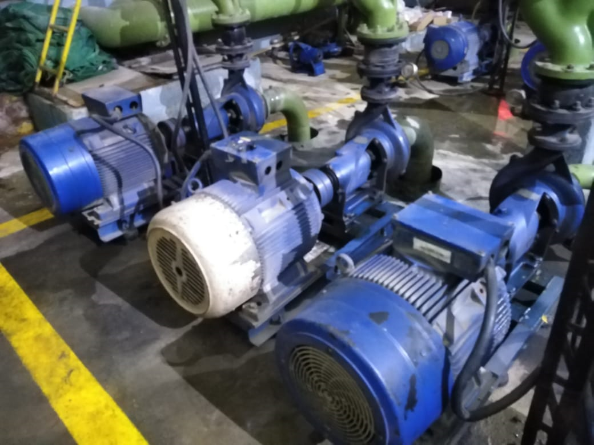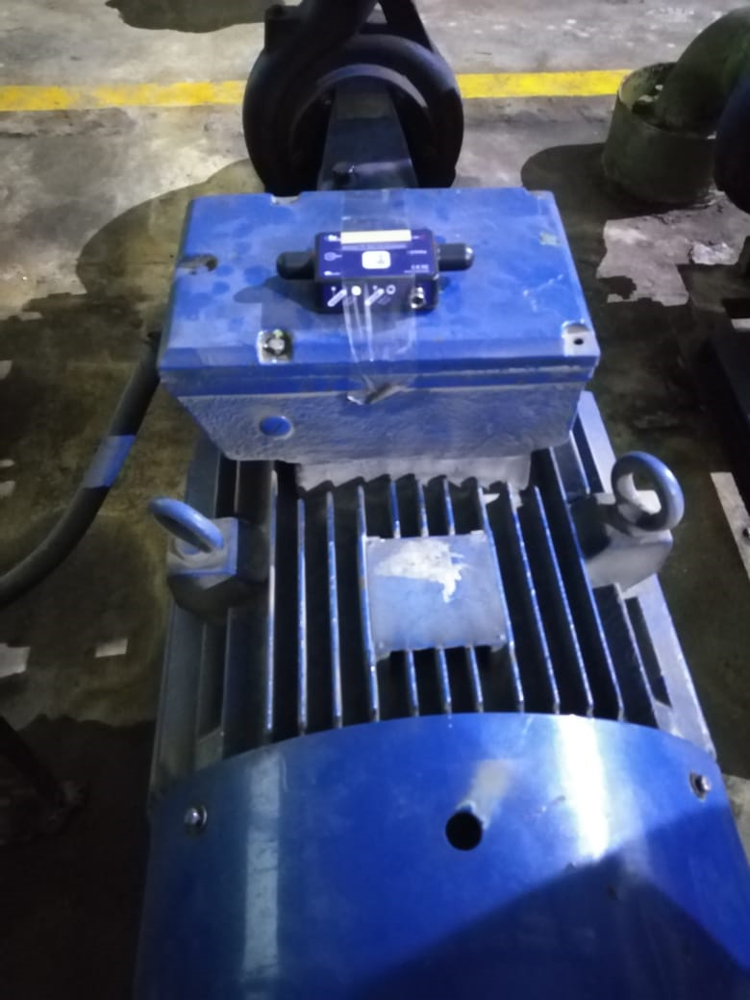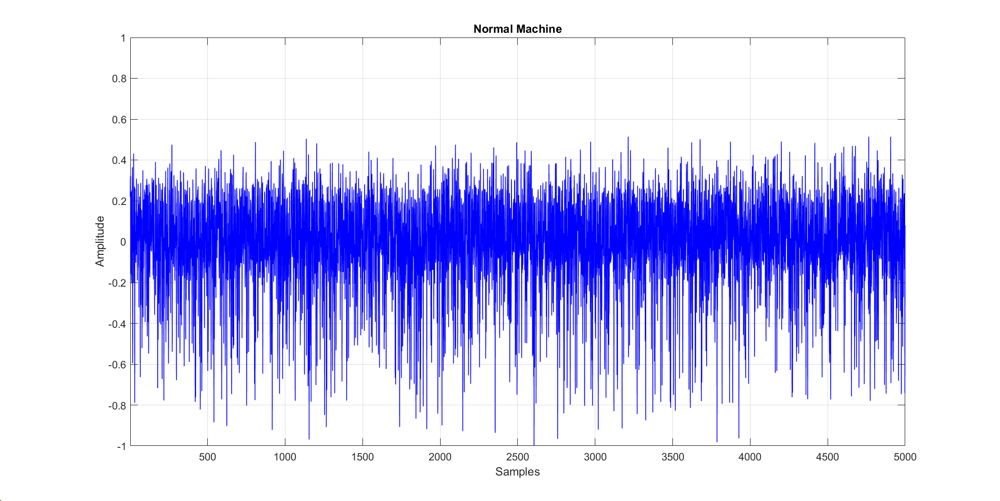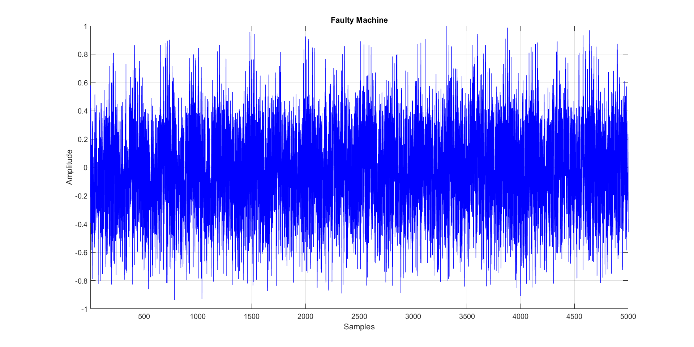

> (**a**) (**b**)
>
> **Figure** **2.** Data Acquisition Setup. (**a**) Motor Assembly.
> (**b**) Accelerometer Placement.
>
> 3.2. Preprocessing
>
> The accelerometer provides three independent channels of time domain
> vibration signals corresponding to x, y and z axis. These channels are
> combined to form a single time domain signal using the equation,
>
> q
>
> S(t) = x(t)2 +y(t)2 +z(t)2 (1)
>
> The signal S(t) is then normalized by dividing each sample by the
> maximum ampli-tude value. Figure 3 shows the raw signals acquired from
> normal and faulty motors. It can be observed that faulty motors
> exhibit amplitude spikes in their vibrations which shows the presence
> of high frequency components in the signal spectrum.
>
> (**a**) (**b**)
>
> **Figure3.**
> TimeDomainRepresentationofVibrationsignalforNormalandFaultyMotor.
> (**a**)NormalMotor. (**b**)FaultyMotor.
>
> Empirical Mode Decomposition
>
> The fault indicator proposed in this work is based on the observation
> that in the presence of faults, the spectral components of vibration
> signal increased as compared to healthy spectrum. Moreover, the
> acquired signal is also corrupted by noise and redundant information.
> Therefore, in the next step, the normalized signal is subjected
> empirical mode decomposition, an iterative technique which decomposes
> a raw signal into its time domain sub-components called Intrinsic Mode
> Functions (IMFs) \[43–45\]. The output of

Sensors **2021**, 21, 7587 6 of 15

> EMD remains same in the spectrum. An IMF characterizes the oscillatory
> mode implanted in the signal and it must satisfy following two
> properties.
>
> 1\. The number of maxima and minima must differ atmost by 1 2. The
> mean of IMF is zero
>
> IMF decomposition of a signal is obtained by a process known as
> “sifting” which is performed with the following steps.
>
> 1\. Identify all local minima and maxima of the input signal x(t)
>
> 2\. Create the upper and lower envelope of all local minima and maxima
> by using cubic-spline method
>
> 3\. Designate the mean of upper and lower envelopes as m1 4. Calculate
> h1 = x(t) m1 as the first component
>
> 5\. If h1 is an IMF, take it as first IMF of x(t). Else, take h1 is a
> proto-IMF and name it as h11. Take h11 as the original signal and
> repeat steps 1–4 until h1k is an IMF, and designate it as c1 = h1k,
> where k indicates the number of iterations to produce an IMF.
>
> 6\. Obtain residum r1 = x(t) c1
>
> 7\. Treat r1 as the original signal and apply steps 1–6 to obtain
> other IMFs c2,c3, ,cn as follows:
>
> r1 c1 = r2
>
> .
>
> rn 1 cn = rn
>
> The decomposition process can be stopped when rn becomes a monotonic
> function. However, only few IMFs have physical meaning for most
> practical purposes. At the end of EMD, it gives a signal of the form
>
> n
>
> x(t) = åci(t)+rn, (2)
>
> i=1
>
> where x(t) is decomposed into n IMFs and a residue rn. Figure 4a,b
> illustrate few IMFs extracted from normal and faulty signals of
> machines. High frequency com-ponents can be observed in lower IMFs. In
> this work, total 10 IMFs are extracted. It was conceived
> experimentally that first IMF (IMF1) contained noisy elements and
> redundant components. Therefore, this component was rejected. The
> remaining nine IMFs and residual signal were added together to
> construct the preprocessed signal.
>
> 3.3. Feature Extraction
>
> Feature extraction is a crucial step in machine learning and pattern
> recognition frame-works. One type of feature is never adequate to
> extract all hidden characteristic infor-mation from the signals of
> different classes. In this work, different combinations of time, and
> frequency domain features are systematically tested to find out the
> best performing combination with the highest classification accuracy
> and lowest feature dimensions.
>
> 3.3.1. Temporal Features
>
> Temporalfeaturesdefinevariousstatisticaldescriptorsextractedfromthetimedomain
> representation of vibration signal \[46\]. This work uses a number of
> classical time domain statistical features such as mean, standard
> deviation, root mean square (RMS) and signal energy to obtain
> differences between one vibration signal and another. In addition, due
> to non stationary nature of vibration signal of faulty machines, more
> advanced statistical features such as skewness and kurtosis are also
> investigated in this work. These features computed using the
> probability density function (PDF) of the time domain signal. Since
> the PDF of vibration signal changes with change in condition of
> machine bearing, thus skewness and kurtosis also change. The kurtosis
> quantifies the peak value of the PDF of

Sensors **2021**, 21, 7587 7 of 15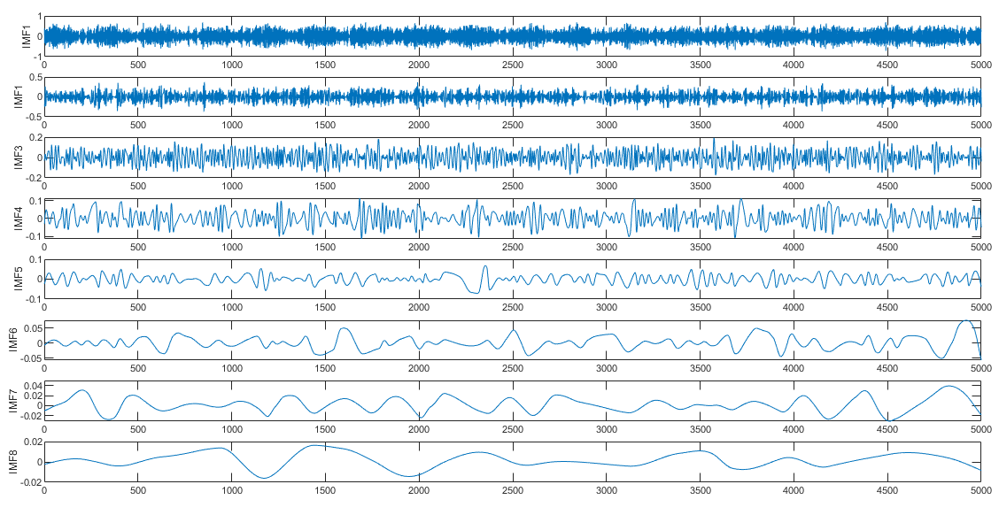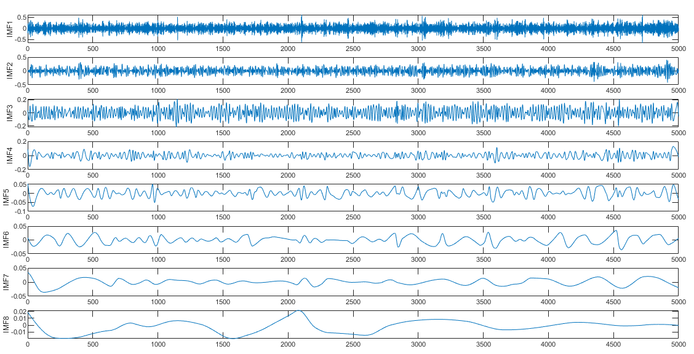

> the signal, whereas the skewness quantifies the asymmetry behavior of
> PDF. Studies show that kurtosis for a normal machine machine is
> approximately three and its skewness value is approximately zero
> \[47\]. In case of PDF changes due to a machine fault, the kurtosis
> value increases and skewness value becomes positive or negative.
>
> (**a**)
>
> (**b**)
>
> **Figure** **4.** IMFs of vibration signals of Normal and Faulty
> machines. (**a**) Normal Motor. (**b**) Faulty Motor.

Sensors **2021**, 21, 7587 8 of 15

> 3.3.2. Spectral Features
>
> Spectral features are extracted from the frequency domain
> representation of a signal. In order to convert the time domain signal
> in to frequency domain, FFT is a common method of analysis which
> obtains the dominant frequency of the repetitive impulse period of
> certain machine faults. Several classical spectral features are used
> in this work and obtained from amplitude spectrum of vibration signal.
> These features include mean frequency, median frequency and standard
> deviation. In addition, various advanced spectral features have also
> been investigated in this work. These include spectral kurtosis,
> spectral centroid, spectral flux, spectral roll-off, spectral flatness,
> spectral crest, spectral decrease, spectral slope and spectral spread.
> Table 2 lists all features used in this work along with their
> acronyms.
>
> **Table** **2.** List of Features investigated for classification.
>
> **Time** **Domain**
>
> **Feature** **Acronym**
>
> **Frequency** **Domain**

**Feature** **Acronym**

> Mean M Standard Deviation SD Skewness SK Kurtosis KR Peak to Peak PP
> Root Mean Square RMS Energy E

Mean Frequency FM Frequency Standard Deviation FSD Skewness of Frequency
FSK Kurtosis of Frequency FKR Band Power BPWR Median Frequency FMED
Spectral Centroid SC Spectral Flux SF Spectral Roll Off SRO Spectral
Flatness SFL Spectral Crest SCR Spectral Decrease SDEC Spectral Slope
SSL Spectral Spread SS

> 3.3.3. Hybrid Features
>
> Inthiswork,thehybridfeaturesaredefinedasthefeaturevectorsconsistingofvarious
> combination of temporal and spectral features.
>
> 3.4. Classification
>
> In the final step, the extracted time and spectral features are fused
> together in different combinations and applied to a set of classifiers.
> In this study, a 10-folds cross-validation scheme is adopted to
> train/test the classification models. In this scheme, the dataset is
> divided into ten equal folds. In each iteration, one fold is employed
> for testing, and the remaining nine folds are used to train the model.
> This procedure is repeated 10 times, and the final performance is
> computed by taking an average of all runs. As shown in Table 1, the
> data comprises of 103 normal, 117 faulty and a total of 220 signal
> observations. Each observationiscomposedof5000signalsamples.
> Ineachiterationof10-foldcross-validation, 22 observations (10 Normal
> and 12 Faulty signals) were used for testing, and the remaining 198
> (93 Normal and 105 Faulty) were employed for training the
> classification model. This process is iterated 10 times, and the model
> is tested and trained on all observations. This scheme is more
> preferable for a dataset of comparatively small size.
>
> The classification is performed using different kernel settings of SVM,
> linear discrimi-nant analysis (LDA), decision tree (DT) and k-nearest
> neighbours (KNN) classifiers.

Sensors **2021**, 21, 7587 9 of 15

> **4.** **Performance** **Analysis** 4.1. Feature Analysis
>
> In order to find the best describing feature set combination with
> lowest dimensions, we performed experimentation with two base line
> classifiers, i.e., support vector machine with Quadratic kernel
> (SVM-Q), and k-nearest neighbors with weighted kernel (KNN-W).
> TheperformanceoftheseclassifiersondifferentfeaturesetsisdemonstratedinTable
> 3. The feature sets F1-F3 are composed of single domain features,
> i.e., time or frequency, whereas F4-F7 are hybrid feature sets
> consisting of a combination of time as well as frequency features. The
> SVM-Q achieves an accuracy of 90.5%, 94.1%, and 94.1% for time,
> frequency and spectral features respectively. Among the various
> feature sets that we tried, the set F4 achieves the best classification
> performance using SVM-Q classifier, achieving an accuracy of 98.2%.
> This best combination has a feature size of 13. A full combination of
> all features, i.e., F7 has 96.5% accuracy however, in this case the
> feature dimensions becomes considerably large, i.e., 21 features.
>
> **Table** **3.** Performance evaluation of different feature sets
> combination with several classifiers
>
> **Accuracy** **(%)** **Feature** **Set** **Size** **Feature**
> **Class** **Features** **in** **the** **Set** **SVM-Q** **KNN=W**
>
> F1 7 Temporal
>
> F2 6 Frequency
>
> F3 8 Frequency
>
> **F4** **13** **Hybrid**
>
> F5 14 Hybrid
>
> F6 15 Hybrid
>
> F7 21 Hybrid
>
> M,SD,SK,KR,PP,RMS,E
>
> FM,FSD,FSK,FKR,BPWR,FMED
>
> SC,SF,SRO,SFL,SCR,SDEC,SSL,SS
>
> **M,SD,SK,KR,PP,RMS,E** **FM,FSD,FSK,FKR,BPWR,FMED**

FM, FSD, FSK, FKR,BPWR,FMED, SC,SF,RO,SFL,SCR,SDEC,SL,SS

> M, SD, SKW,KR,PP,RMS,E, SC,SF,SRO,SFL,SCR,SDEC,SSL,SS
>
> M,SD,SK,KR,PP,RMS,E FM,FSD,FSK,FKR,BPWR,FMED
> SC,SF,SRO,SFL,SCR,SDEC,SSL,SS

90.5 90.0

94.1 93.6

94.1 92.3

> **98.2** **90.0**
>
> 95 91.4

91.4 91.4

96.5 90.5

> In pattern recognition problems, a relationship between different
> feature classes can be efficiently illustrated using a scatter plot.
> Best features are identified as those having maximum inter-class
> difference, i.e., the means of both classes lie at maximum distance
> from each other in scatter plot, whereas intra-class difference is
> minimum for the same feature. As an example, Figure 5a shows the
> predictions of SVM-Q classifier on joint feature vector of temporal
> mean and standard deviation. Similarly, Figure 5b shows the SVM-Q
> predictions on frequency standard deviation and skewness features. In
> this way, classifier predictions were visually analyzed to obtain
> promising feature vector combinations for classification.

Sensors **2021**, 21, 7587 10 of 15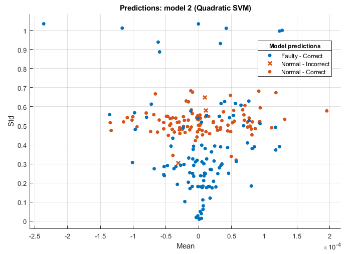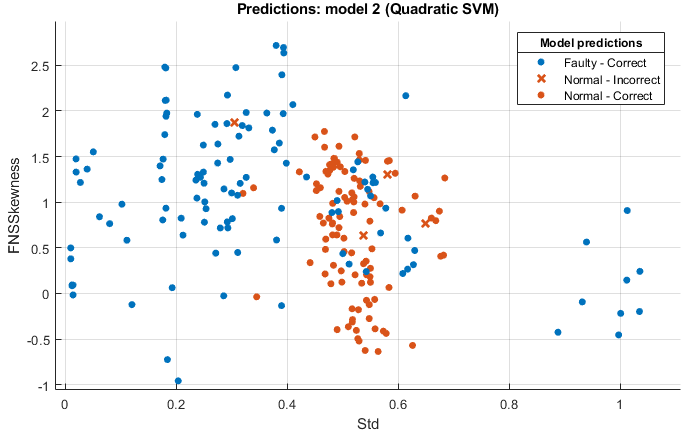

> (**a**)
>
> (**b**)
>
> **Figure5.**
> ModelPredictionsofSVM-QClassifiersforvariouscombinationsoftemporalandfrequency
> domain features. (**a**) Temporal Mean and Standard Deviation. (**b**)
> Frequency standard deviation and skewness.
>
> 4.2. Classification Performance
>
> In the next step, best feature set of Table 3, i.e., F4 comprising of
> time and frequency features is selected for classification using a
> range of classifiers namely, Linear Discriminant Analysis (LDA),
> Decision Tree (DT), KNN with K = 10 (KNN-M), KNN with K = 1 (KNN-F),
> KNN with the weighted kernel (KNN-W), SVM with the quadratic kernel
> (SVM-Q), SVM with linear kernel (SVM-L), SVM with cubic kernel
> (SVM-C), and SVM with Gaussian Kernel (SVM-G). Table 4 shows the
> performance of these classifiers in terms of standard performance
> metrics of specificity, sensitivity, accuracy and error. SVM-Q achieves
> best classification performance with 98.2% accuracy, 96.6% sensitivity,
> 100.0% specificity and 1.8% error rate. These results are also
> graphically illustrated in Figure 6. Most of the

Sensors **2021**, 21, 7587 11 of 15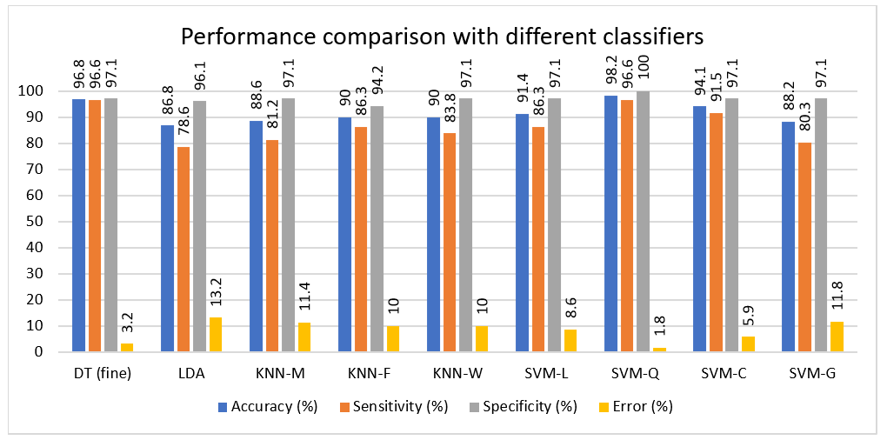

> classifiers used in this work achieve an accuracy above 90% which shows
> the validity of proposed approach.
>
> **Table** **4.** Performance of feature set **F4** with a range of
> classification methods.
>
> **Classifier**
>
> DT (fine) LDA KNN-M KNN-F KNN-W SVM-L
>
> **SVM-Q** SVM-C SVM-G

**Accuracy** **(%)**

> 96.8 86.8 88.6 90 90 91.4 **98.2** 94.1 88.2

**Sensitivity** **(%)**

> 96.6 78.6 81.2 86.3 83.8 86.3 **96.6** 91.5 80.3

**Specificity** **(%)**

> 97.1 96.1 97.1 94.2 97.1 97.1 **100** 97.1 97.1

**Error** **(%)**

> 3.2 13.2 11.4 10 10 8.6 1.8 5.9 11.8
>
> **Figure** **6.** Performance comparison of different classifiers in
> terms of accuracy, sensitivity, specificity, and error.
>
> Figure 7 shows the confusion matrix of classification performance with
> SVM-G clas-sifier. Out of 117 faulty vibration signals, only 4 are
> misclassified as Normal and the remaining 113 signal are correctly
> predicted. Moreover, all 103 signals acquired from normal/healthy
> motors are correctly predicted as normal by the classifier.
>
> Figure 8 illustrates the confusion matrix information in term of
> sensitivity and specificity. Faulty class achieves 96.6% sensitivity,
> whereas the normal class achieves 100% specificity.

Sensors **2021**, 21, 7587 12 of 15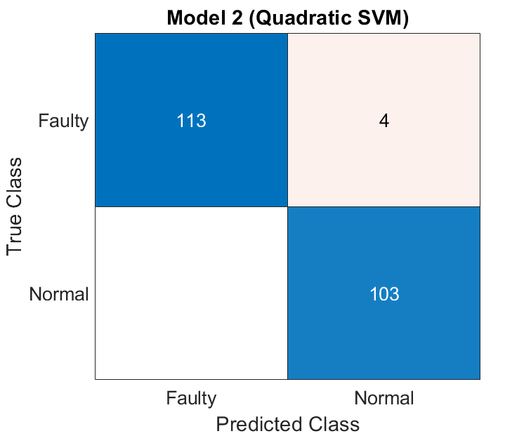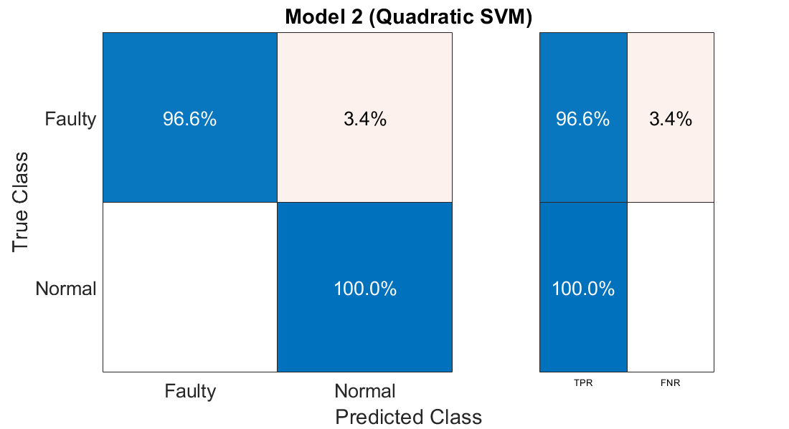

> **Figure** **7.** Confusion Matrix of classification using SVM-Q.
>
> **Figure** **8.** Confusion Matrix in terms of sensitivity and
> specificity.
>
> **5.** **Conclusions** **and** **Future** **Work**
>
> Early and accurate machine fault detection plays an important role to
> ensure the productivityandeconomicstabilityofindustrialenterprises.
> Inmostofemergingmultiport
> energyconversionsystems,criticalfunctionsareperformedbyrotatingmachinesespecially
> motors. The vibration signals contain a wealth of information about
> the health and state of the machine. However, due to time varying
> nature of vibration signals, using them for accurate detection of
> machine faults is not a trivial tasks. This calls for extraction of
> powerful features from vibration data and selection of appropriate
> classification methods. In this work, an approach is proposed for fault
> identification of large industrial motors. This work has three main
> contributions.

Sensors **2021**, 21, 7587 13 of 15

> 1\. Since, the reliability of any system based on machine learning
> depends upon effective-ness of collected dataset. In this work, the
> vibration signal dataset is constructed from real-time, practical
> industrial setup rather than using data collected from laboratory
> environment.
>
> 2\. In order to remove the noise contribution from practical sources,
> an efficient signal conditioning approach is proposed based on
> Empirical mode decomposition.
>
> 3\. While most of the published works in this domain are concentrated
> on using a single class of features of fault detection, this work is
> based on an approach based on hybrid features. we systematically
> analyzed the performance of different combinations of time and
> frequency domain features using a range of classifiers with multiple
> settings.
>
> The proposed approach can be applied to any industrial setup for real
> time detection of machine faults using vibration analysis. In future
> work, we aim to extend this work to
> performmulti-classidentificationofindividualfaultsofmachines.
> Moreover,increasingthe number of data samples and feature reduction
> methods can also improve the performance with reasonable complexity.
>
> **Author** **Contributions:** Conceptualization, A.K., S.A. and M.A.;
> methodology, A.K, M.A. and M.A.K.; software, S.A. and M.A.;
> validation, M.A.K., S.A.I. and K.A.; formal analysis, K.A. and M.A.K.;
> investigation, M.A. and S.A.I.; resources, K.A. and S.A.; data
> curation, S.A. and S.A.I.; writing—original draft preparation, A.K.,
> M.A. and M.A.K.; writing—review and editing, H.A., M.A.K. and S.M.M.;
> visualization, S.M.M.; supervision, S.A. and M.A.K.; project
> administration, H.A. and S.A.I.; funding acquisition, H.A., S.M.M. and
> M.A.K. All authors have read and agreed to the published version of
> the manuscript.
>
> **Funding:** The authors extend their appreciation to the Deanship of
> Scientific Research at King Khalid University for funding this work
> under Grant RGP.2/53/42.
>
> **Data** **Availability** **Statement:** The dataset and code of this
> work can be provided on request.
>
> **Conflicts** **of** **Interest:** The authors declare no conflict of
> interests.
>
> **Abbreviations**
>
> The following abbreviations are used in this manuscript:
>
> PSD Power Spectral Density
>
> STFT Short Time Fourier Transform DFT Discrete Fourier Transform LD
> Linear dichroism
>
> HT Hilbert Transform
>
> DWT Discrete Wavelet Transform CWT Continuous Wavelet Transform ANN
> Artifical Neural Network
>
> SVM Support Vector Machines KNN K Nearest Neighbors
>
> EMD Empirical Mode Decomposition IMF Intrinsic Mode Function
>
> RMS Root Mean Square DT Decision Tree
>
> SVM-Q SVM with quadratic kernel
>
> **References**
>
> 1\. Mallak, A.; Fathi, M. Sensor and Component Fault Detection and
> Diagnosis for Hydraulic Machinery Integrating LSTM Autoencoder
> Detector and Diagnostic Classifiers. Sensors **2021**, 21, 433.
> [\[CrossRef\]](http://doi.org/10.3390/s21020433)
> [\[PubMed\]](http://www.ncbi.nlm.nih.gov/pubmed/33435428)
>
> 2\. Arellano-Espitia, F.; Delgado-Prieto, M.; Gonzalez-Abreu, A.D.;
> Saucedo-Dorantes, J.J.; Osornio-Rios, R.A. Deep-Compact-Clustering
> Based Anomaly Detection Applied to Electromechanical Industrial
> Systems. Sensors **2021**, 21, 5830.
> [\[CrossRef\]](http://dx.doi.org/10.3390/s21175830)
>
> 3\. Jin, H.; Titus, A.; Liu, Y.; Wang, Y.; Han, Z. Fault diagnosis of
> rotary parts of a heavy-duty horizontal lathe based on wavelet packet
> transform and support vector machine. Sensors **2019**, 19, 4069.
> [\[CrossRef\]](http://dx.doi.org/10.3390/s19194069)
> [\[PubMed\]](http://www.ncbi.nlm.nih.gov/pubmed/31547146)

Sensors **2021**, 21, 7587 14 of 15

> 4\. Zhu, Z.; Wang, L.; Peng, G.; Li, S. WDA: An Improved Wasserstein
> Distance-Based Transfer Learning Fault Diagnosis Method. Sensors
> **2021**, 21, 4394.
> [\[CrossRef\]](http://dx.doi.org/10.3390/s21134394)
>
> 5\. Safavi, S.; Safavi, M.A.; Hamid, H.; Fallah, S. Multi-Sensor Fault
> Detection, Identification, Isolation and Health Forecasting for
> Autonomous Vehicles. Sensors **2021**, 21, 2547.
> [\[CrossRef\]](http://dx.doi.org/10.3390/s21072547)
>
> 6\. Huerta-Rosales, J.R.; Granados-Lieberman, D.; Garcia-Perez, A.;
> Camarena-Martinez, D.; Amezquita-Sanchez, J.P.; Valtierra-Rodriguez,
> M. Short-Circuited Turn Fault Diagnosis in Transformers by Using
> Vibration Signals, Statistical Time Features, and Support Vector
> Machines on FPGA. Sensors **2021**, 21, 3598.
> [\[CrossRef\]](http://dx.doi.org/10.3390/s21113598)
>
> 7\. Desheng, L.; Beibei, Y.; Yu, Z.; Jinping, S. Time-frequency
> analysis based on BLDC motor fault detection using Hermite S-method.
> In Proceedings of the 2012 IEEE International Conference on Computer
> Science and Automation Engineering (CSAE), Zhangjiajie, China, 25–27
> May 2012; Volume 2, pp. 592–596.
>
> 8\. Aimer, A.F.; Boudinar, A.H.; Benouzza, N.; Bendiabdellah, A.
> Simulation and experimental study of induction motor broken rotor bars
> fault diagnosis using stator current spectrogram. In Proceedings of
> the 2015 3rd International Conference on Control, Engineering &
> Information Technology (CEIT), Tlemcen, Algeria, 25–27 May 2015; pp.
> 1–7.
>
> 9\. Gu, F.C.; Bian, J.Y.; Hsu, C.L.; Chen, H.C.; Lu, S.D. Rotor Fault
> Identification of Induction Motor Based on Discrete Fractional Fourier
> Transform. In Proceedings of the 2018 International Symposium on
> Computer, Consumer and Control (IS3C), Taichung, Taiwan, 6–8 December
> 2018; pp. 205–208.
>
> 10\. Song, X.; Wang, Z.; Hu, J. Detection of Bearing Outer Race Fault
> in Induction Motors using Motor Current Signature Analy-sis. In
> Proceedings of the 2019 22nd International Conference on Electrical
> Machines and Systems (ICEMS), Harbin, China, 11–14 August 2019; pp.
> 1–5.
>
> 11\. Vippala, S.R.; Bhat, S.; Reddy, A.A. Condition Monitoring of BLDC
> Motor Using Short Time Fourier Transform. In Proceed-ings of the 2021
> IEEE Second International Conference on Control, Measurement and
> Instrumentation (CMI), Kolkata, India, 8–10 January 2021; pp. 110–115.
>
> 12\. Dehina, W.; Boumehraz, M.; Kratz, F. Diagnosis and Detection of
> Rotor Bars Faults in Induction Motor Using HT and DWT Techniques. In
> Proceedings of the 2021 18th International Multi-Conference on
> Systems, Signals & Devices (SSD), Monastir, Tunisia, 22–25 March 2021;
> pp. 109–115.
>
> 13\. Zabin, M.; Choi, H.J.; Uddin, J.; Furhad, M.H.; Ullah, A.B.
> Industrial Fault Diagnosis using Hilbert Transform and Texture
> Features. In Proceedings of the 2021 IEEE International Conference on
> Big Data and Smart Computing (BigComp), Jeju Island, Korea, 17–20
> January 2021; pp. 121–128.
>
> 14\. Wang, W.; Huang, Q.; Zhang, Y. On the motor fault diagnosis based
> on wavelet transform and ann. In Proceedings of the 31st Chinese
> Control Conference, Hefei, China, 25–27 July 2012; pp. 5339–5346.
>
> 15\. Salazar-Villanueva, F.; Ibarra-Manzano, O.G. Spectral analysis
> for identifying faults in induction motors by means of sound. In
> Proceedings of the CONIELECOMP 2013, 23rd International Conference on
> Electronics, Communications and Computing, Cholula, Puebla, Mexico,
> 11–13 March 2013; pp. 149–153.
>
> 16\. Abdo, A.; Siam, J.; Abdou, A.; Mustafa, R.; Shehadeh, H.
> Electrical Fault Detection in Three-Phase Induction Motor Based on
> Acoustics. In Proceedings of the 2020 IEEE International Conference on
> Environment and Electrical Engineering and 2020 IEEE Industrial and
> Commercial Power Systems Europe (EEEIC/I&CPS Europe), Madrid, Spain,
> 9–12 June 2020; pp. 1–5.
>
> 17\. Orman, M.; Rzeszucinski, P.; Tkaczyk, A.; Krishnamoorthi, K.;
> Pinto, C.T.; Sulowicz, M. Bearing fault detection with the use of
> acoustic signals recorded by a hand-held mobile phone. In Proceedings
> of the 2015 International Conference on Condition Assessment
> Techniques in Electrical Systems (CATCON), Bangalore, India, 10–12
> December 2015; pp. 252–256.
>
> 18\. Liu, H.; Li, L.; Ma, J. Rolling bearing fault diagnosis based on
> STFT-deep learning and sound signals. Shock Vib. **2016**, 2016,
> 6127479. [\[CrossRef\]](http://dx.doi.org/10.1155/2016/6127479)
>
> 19\. Yao, Y.; Wang, H.; Li, S.; Liu, Z.; Gui, G.; Dan, Y.; Hu, J.
> End-to-end convolutional neural network model for gear fault diagnosis
> based on sound signals. Appl. Sci. **2018**, 8, 1584.
> [\[CrossRef\]](http://dx.doi.org/10.3390/app8091584)
>
> 20\. Raad, A.; Antoni, J.; Sidahmed, M. Indicators of
> cyclostationarity: Theory and application to gear fault monitoring.
> Mech. Syst. Signal Process. **2008**, 22, 574–587.
> [\[CrossRef\]](http://dx.doi.org/10.1016/j.ymssp.2007.09.011)
>
> 21\. Miao, Q.; Cong, L.; Pecht, M. Identification of multiple
> characteristic components with high accuracy and resolution using the
> zoom interpolated discrete Fourier transform. Meas. Sci. Technol.
> **2011**, 22, 055701.
> [\[CrossRef\]](http://dx.doi.org/10.1088/0957-0233/22/5/055701)
>
> 22\. Liu, Y.; Guo, L.; Wang, Q.; An, G.; Guo, M.; Lian, H. Application
> to induction motor faults diagnosis of the amplitude recovery method
> combined with FFT. Mech. Syst. Signal Process. **2010**, 24,
> 2961–2971.
> [\[CrossRef\]](http://dx.doi.org/10.1016/j.ymssp.2010.03.008)
>
> 23\. Shi, D.; Qu, L.; Gindy, N. General interpolated fast Fourier
> transform: A new tool for diagnosing large rotating machinery. J. Vib.
> Acoust. **2005**, 127, 351–361
> [\[CrossRef\]](http://dx.doi.org/10.1115/1.1924643)

24\. Randall, R.B.; Antoni, J. Rolling element bearing diagnostics—A
tutorial. Mech. Syst. Signal Process. **2011**, 25, 485–520.
[\[CrossRef\]](http://dx.doi.org/10.1016/j.ymssp.2010.07.017) 25. Kumar,
R.; Singh, M. Outer race defect width measurement in taper roller
bearing using discrete wavelet transform of vibration

> signal. Measurement **2013**, 46, 537–545.
> [\[CrossRef\]](http://dx.doi.org/10.1016/j.measurement.2012.08.012)
>
> 26\. Zuo, M.J.; Lin, J.; Fan, X. Feature separation using ICA for a
> one-dimensional time series and its application in fault detection. J.
> Sound Vib. **2005**, 287, 614–624.
> [\[CrossRef\]](http://dx.doi.org/10.1016/j.jsv.2005.02.005)
>
> 27\. Wang, D.; Peter, W.T.; Guo, W.; Miao, Q. Support vector data
> description for fusion of multiple health indicators for enhancing
> gearbox fault diagnosis and prognosis. Meas. Sci. Technol. **2010**,
> 22, 025102.
> [\[CrossRef\]](http://dx.doi.org/10.1088/0957-0233/22/2/025102)
>
> 28\. Ágoston, K. Fault detection of the electrical motors based on
> vibration analysis. Procedia Technol. **2015**, 19, 547–553.
> [\[CrossRef\]](http://dx.doi.org/10.1016/j.protcy.2015.02.078)

Sensors **2021**, 21, 7587 15 of 15

> 29\. Finley, W.R.; Hodowanec, M.M.; Holter, W.G. An analytical
> approach to solving motor vibration problems. In Proceedings of the
> Industry Applications Society 46th Annual Petroleum and Chemical
> Technical Conference (Cat. No. 99CH37000), San Diego, CA, USA, 13–15
> September 1999; pp. 217–232.
>
> 30\. Rahman, M.; Azam, T.; Saha, S.K. Motor fault detection using
> vibration patterns. In Proceedings of the International Conference on
> Electrical & Computer Engineering (ICECE 2010), Dhaka, Bangladesh,
> 18–20 December 2010; pp. 486–489.
>
> 31\. Su, H.; Chong, K.T.; Kumar, R.R. Vibration signal analysis for
> electrical fault detection of induction machine using neural networks.
> Neural Comput. Appl. **2011**, 20, 183–194.
> [\[CrossRef\]](http://dx.doi.org/10.1007/s00521-010-0512-3)
>
> 32\. Principi, E.; Rossetti, D.; Squartini, S.; Piazza, F.
> Unsupervised electric motor fault detection by using deep
> autoencoders. IEEE/CAA J. Autom. Sin. **2019**, 6, 441–451.
> [\[CrossRef\]](http://dx.doi.org/10.1109/JAS.2019.1911393)
>
> 33\. Chaudhari, Y.K.; Gaikwad, J.A.; Kulkarni, J.V. Vibration analysis
> for bearing fault detection in electrical motors. In Proceedings of
> the 2014 First International Conference on Networks & Soft Computing
> (ICNSC2014), Guntur, India, 19–20 August 2014; pp. 146–150.
>
> 34\. Aziz, S.; Ahmed, M.; Naqvi, S.Z.H.; Khan, M.U.; Imtiaz, A.;
> Waseem, A. Machine Bearing Fault Diagnosis System using Tri-Axial
> Accelerometer. In Proceedings of the 2020 International Conference on
> Electrical, Communication, and Computer Engineering (ICECCE),
> Istanbul, Turkey, 12–13 June 2020; pp. 1–6.
>
> 35\. Venkata, S.K.; Rao, S. Fault detection of a flow control valve
> using vibration analysis and support vector machine. Electronics
> **2019**, 8, 1062.
> [\[CrossRef\]](http://dx.doi.org/10.3390/electronics8101062)
>
> 36\. Li, C.; Sánchez, R.V.; Zurita, G.; Cerrada, M.; Cabrera, D. Fault
> diagnosis for rotating machinery using vibration measurement deep
> statistical feature learning. Sensors **2016**, 16, 895.
> [\[CrossRef\]](http://dx.doi.org/10.3390/s16060895)
>
> 37\. Yetis, H.; Karakose, M.; Aydin, I.; Akin, E. Bearing fault
> diagnosis in traction motor using the features extracted from filtered
> signals. In Proceedings of the 2019 International Artificial
> Intelligence and Data Processing Symposium (IDAP), Malatya, Turkey,
> 21–22 September 2019; pp. 1–4.
>
> 38\. Ye, F.; Zhang, Z.; Chakrabarty, K.; Gu, X. Board-level functional
> fault diagnosis using multikernel support vector machines and
> incremental learning. IEEE Trans. Comput.-Aided Des. Integr. Circuits
> Syst. **2014**, 33, 279–290.
> [\[CrossRef\]](http://dx.doi.org/10.1109/TCAD.2013.2287184)
>
> 39\. Sakhalkar, N.P.; Korde, P. Fault detection in induction motors
> based on motor current signature analysis and accelerometer. In
> Proceedings of the 2017 International Conference on Energy,
> Communication, Data Analytics and Soft Computing (ICECDS), Chennai,
> India, 1–2 August 2017; pp. 363–367.
>
> 40\. Weng, P.Y.; Liu, M.K. Roller bearing fault diagnosis based on
> wavelet packet decomposition and support vector machine. In
> Proceedings of the 2017 International Conference on Applied System
> Innovation (ICASI), Sapporo, Japan, 13–17 May 2017; pp. 33–36.
>
> 41\. Zheng, H.; Zhou, L. Rolling element bearing fault diagnosis based
> on support vector machine. In Proceedings of the 2012 2nd
> International Conference on Consumer Electronics, Communications and
> Networks (CECNet), Yichang, China, 21–23 April 2012; pp. 544–547.
>
> 42\. Han, J.H.; Choi, D.J.; Hong, S.K.; Kim, H.S. Motor fault
> diagnosis using CNN based deep learning algorithm considering motor
> rotating speed. In Proceedings of the 2019 IEEE 6th International
> Conference on Industrial Engineering and Applications (ICIEA), Tokyo,
> Japan, 2–15 April 2019; pp. 440–445.
>
> 43\. Li, R.; He, D. Rotational machine health monitoring and fault
> detection using EMD-based acoustic emission feature quantification.
> IEEE Trans. Instrum. Meas. **2012**, 61, 990–1001.
> [\[CrossRef\]](http://dx.doi.org/10.1109/TIM.2011.2179819)
>
> 44\. Shen, Z.; Chen, X.; Zhang, X.; He, Z. A novel intelligent gear
> fault diagnosis model based on EMD and multi-class TSVM. Measurement
> **2012**, 45, 30–40.
> [\[CrossRef\]](http://dx.doi.org/10.1016/j.measurement.2011.10.008)
>
> 45\. Aziz, S.; Khan, M.U.; Alhaisoni, M.; Akram, T.; Altaf, M.
> Phonocardiogram Signal Processing for Automatic Diagnosis of
> Congenital Heart Disorders through Fusion of Temporal and Cepstral
> Features. Sensors **2020**, 20, 3790.
> [\[CrossRef\]](http://dx.doi.org/10.3390/s20133790)
>
> 46\. Nandy, A. Statistical methods for analysis of parkinsonâ ™s
> disease gait pattern and classification. Multimed. Tools Appl.
> **2019**, 78, 19697–19734.
> [\[CrossRef\]](http://dx.doi.org/10.1007/s11042-019-7310-4)
>
> 47\. Caesarendra, W.; Tjahjowidodo, T. A review of feature extraction
> methods in vibration-based condition monitoring and its application
> for degradation trend estimation of low-speed slew bearing. Machines
> **2017**, 5, 21.
> [\[CrossRef\]](http://dx.doi.org/10.3390/machines5040021)
